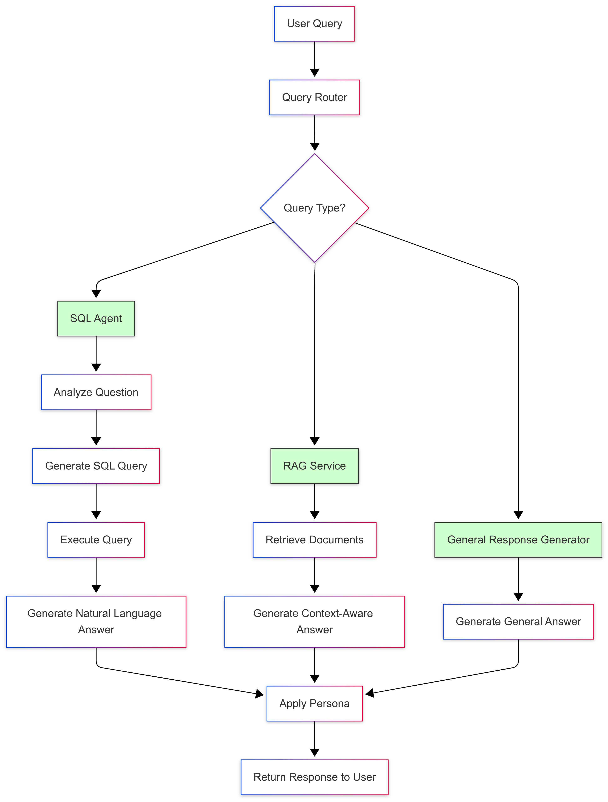
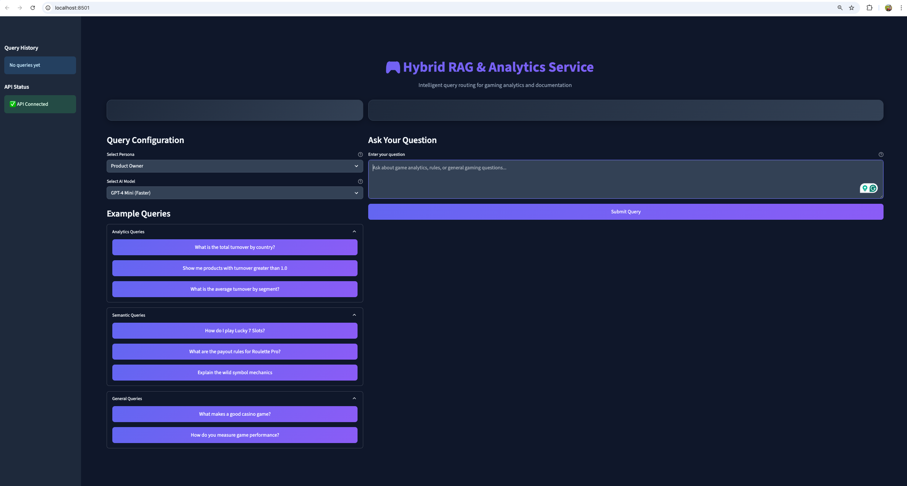
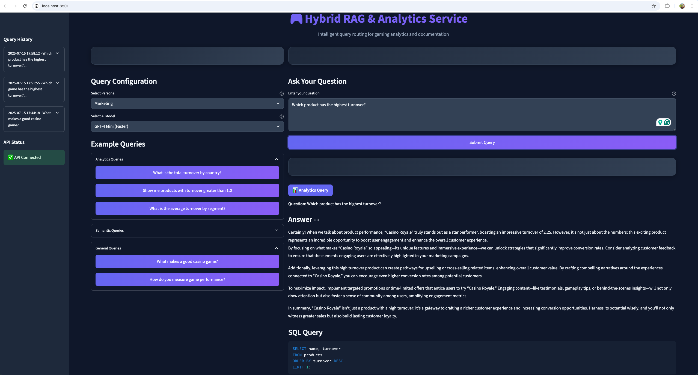
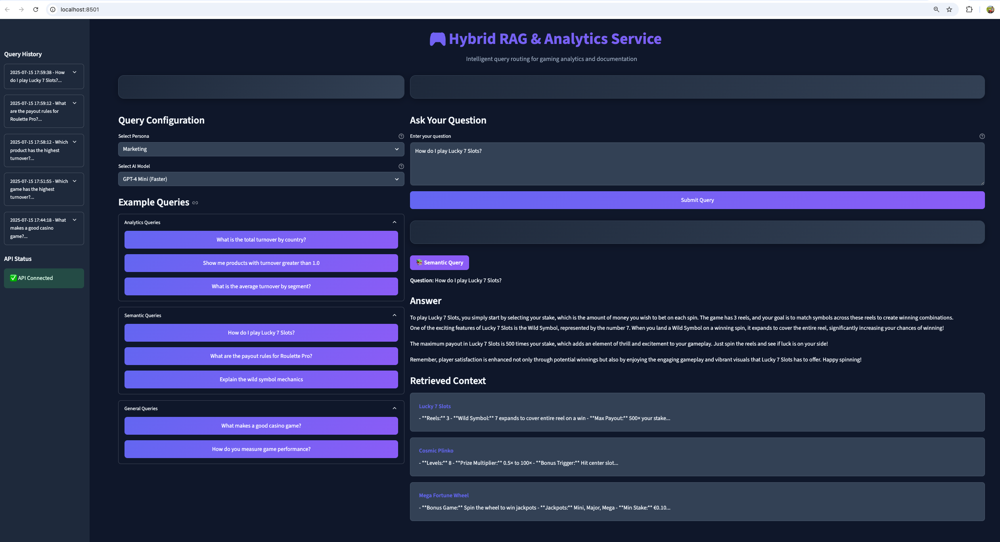
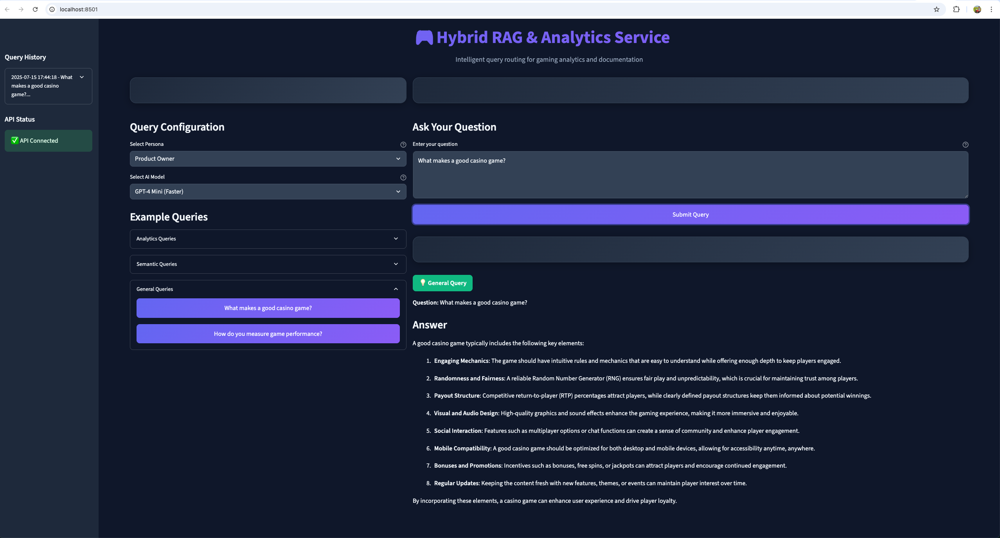

# Hybrid RAG & Analytics Service Documentation

## Introduction

The Hybrid RAG & Analytics Service is an intelligent query routing system that combines the power of Retrieval-Augmented Generation (RAG) with SQL analytics. It automatically classifies user queries and routes them to the appropriate processing engine - whether that's querying a SQL database for analytics, searching through documentation for game rules, or generating general responses.

### Key Features

- **Intelligent Query Classification**: Automatically determines whether a query is analytics-based, semantic (documentation), or general
- **Dual Persona Support**: Responses can be tailored for either Product Owners (technical) or Marketing teams (user-focused)
- **SQL Query Generation**: Converts natural language questions into SQL queries
- **RAG-based Documentation Search**: Searches through game documentation to answer rules and gameplay questions
- **Modern UI**: Clean, responsive Streamlit interface with dark theme
- **Query History**: Tracks and allows reuse of previous queries
- **Real-time Health Monitoring**: Shows API connection status

## System Architecture

### SQL Agent Flow




## Core Architecture
The application is built using FastAPI as the web framework and LangChain to orchestrate the different LLM components. The core logic resides in the /query endpoint in main.py, which follows these steps:

Receive Query: The system accepts a natural language question and a persona (e.g., product_owner).

Classify & Route: The QueryRouter uses an LLM (gpt-4o-mini) to classify the question into one of three categories:

analytics: For questions requiring data aggregation, filtering, or metrics from a structured database.

semantic: For questions about rules, features, or gameplay mechanics found in unstructured documents.

general: For all other open-ended questions.

Process Query: Based on the classification, the request is handled by the appropriate service:

Analytics: The SQLQueryAgent processes the query.

Semantic: The RAGService processes the query.

General: A direct call to the LLM generates a response.

Apply Persona: The initial answer is passed to a final LLM call (apply_persona or generate_general_response) which reframes the content to match the tone, terminology, and focus of the selected persona.

Return Response: A structured JSON object containing the question, query type, final answer, and any relevant context (like the SQL query or source documents) is returned.


## User Interface

### Main Interface

*The main interface showing query input, persona selection, and example queries*

### Analytics Query Example

*Example of an analytics query showing SQL generation and results*

### Semantic Query Example

*Example of a semantic query retrieving game documentation*

### General Query Example

*Example of a general query with contextual response*

## Getting Started

### Prerequisites

- Python 3.11 or higher
- Docker
- OpenAI API key

### Installation

1. **Clone the repository**
```bash
git clone https://github.com/KrishnaPayyavula/fdj-rag-sql-assistant.git
cd fdj-rag-sql-assistant
```


2. **Set up environment variables and local secrets**
```bash
# Create .env file for backend
echo "OPENAI_API_KEY=your-api-key-here" > .env

# (Optional, for local frontend) Add Streamlit secrets/config
mkdir -p frontend/.streamlit
echo 'API_URL = "http://localhost:8000"' > frontend/.streamlit/secrets.toml
```

3. **Install dependencies**
```bash
pip install -r requirements.txt
```

## Running the Application

### Option 1: Using Docker (Recommended)

```bash
# Build and run with docker-compose
docker compose up --build

# The backend will be available at http://localhost:8000
# The frontend will be available at http://localhost:8501
```

### Option 2: Running Individually

#### Backend Service
```bash
# Run the FastAPI backend
python -m src.main

# Or using uvicorn directly
uvicorn src.main:app --host 0.0.0.0 --port 8000 --reload
```

#### Frontend Application
```bash
# In a new terminal, navigate to frontend directory
cd frontend

# Run the Streamlit app
streamlit run streamlit_app.py

# Or with specific configuration
streamlit run streamlit_app.py --server.port 8501 --server.address 0.0.0.0
```

## How to Use

### 1. Select Configuration
- **Persona**: Choose between "Product Owner" (technical responses) or "Marketing" (user-friendly responses)
- **Model**: Select "GPT-4o Mini" (faster) or "GPT-4" (more capable) Currently configured only with GPT-4o Mini

### 2. Enter Your Query
Type your question in the text area. You can ask about:
- **Analytics**: "What is the total turnover by country?"
- **Game Rules**: "How do I play Lucky 7 Slots?"
- **General**: "What makes a good casino game?"

### 3. Use Example Queries
Click on the example queries in the sidebar to quickly test different query types.

### 4. Submit and View Results
- Click "Submit Query" to process your question
- View the classified query type (Analytics/Semantic/General)
- See the generated answer with appropriate formatting
- For analytics queries, view the generated SQL
- For semantic queries, see the retrieved documentation context

### 5. Query History
Access your previous queries from the sidebar to rerun or reference them.

## Technical Stack

### Backend Technologies
- **LangGraph**: Workflow orchestration and state management
- **LangChain**: LLM integration, prompt management, and tool coordination
- **SQLite**: Lightweight database for product analytics data
- **ChromaDB**: Vector database for semantic search
- **OpenAI GPT-4o Mini**: Large language model for query understanding and response generation
- **FastAPI**: High-performance web framework for API endpoints
- **Python 3.11+**: Core programming language

### Frontend Technologies
- **Streamlit**: Rapid web app development framework
- **Requests**: HTTP library for API communication

### Key Components

1. **Query Router**: Classifies queries using GPT-4 into analytics, semantic, or general categories
2. **SQL Agent**: Converts natural language to SQL queries with error handling
3. **RAG Service**: Manages document ingestion and semantic search
4. **Persona Manager**: Adapts responses based on selected persona


## API Endpoints

- `GET /`: Service information
- `GET /health`: Health check for database and RAG connections
- `POST /query`: Main query processing endpoint
- `GET /examples`: Retrieve example queries


### Example cURL Requests

**GET /health**

```bash
curl --location 'http://localhost:8000/health'
```

**GET /examples**

```bash
curl --location 'http://localhost:8000/examples'
```

**POST /query**

```bash
curl --location 'http://localhost:8000/query' \
--header 'Content-Type: application/json' \
--data '{
    "question": "What is the average turnover by segment?",
    "persona": "product_owner"
}'
```

## Future Enhancements

### 1. Action Triggers
Implement automated actions based on query results:
- Send notifications when certain thresholds are met
- Update external dashboards with query insights
- Trigger alerts for anomalies detected in analytics

### 2. Advanced Query Optimization
- Implement query caching for frequently asked questions
- Add query plan optimization for complex analytics
- Support for larger datasets with pagination
- Parallel query execution for multi-part questions

### 3. Model Context Protocol (MCP) Integration
Enable connections to multiple remote data services:
- Connect to external databases (PostgreSQL, MySQL, MongoDB)
- Integrate with cloud data warehouses (Snowflake, BigQuery)
- Support for real-time data streams
- Federated queries across multiple data sources

### 4. Additional Features
- Export functionality for query results (PDF, Excel, CSV)
- Scheduled query execution and reporting
- User authentication and query access control
- Query result visualization with charts and graphs
- Natural language query suggestions and auto-completion

## Troubleshooting

### Common Issues

1. **API Connection Error**
   - Ensure the backend is running on port 8000
   - Check your firewall settings
   - Verify the API_URL in frontend configuration

2. **OpenAI API Errors**
   - Verify your API key is set correctly in the home directory
   - Check your OpenAI account credits
   - Ensure you're using a valid model name

3. **Database Errors**
   - Run the database initialization if products.db doesn't exist
   - Check file permissions in the db directory
   - Verify the CSV data file exists in data/csv/

4. **Frontend Loading Issues**
   - Clear your browser cache
   - Check for JavaScript console errors
   - Ensure Streamlit is running on the correct port

